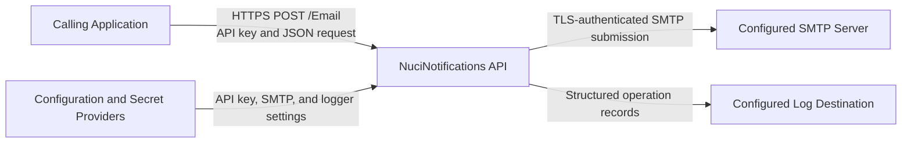
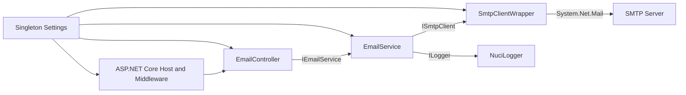
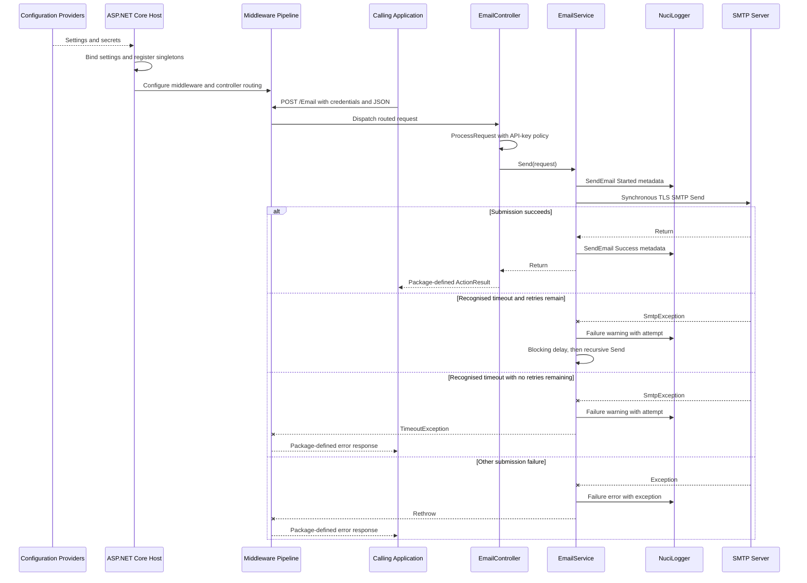
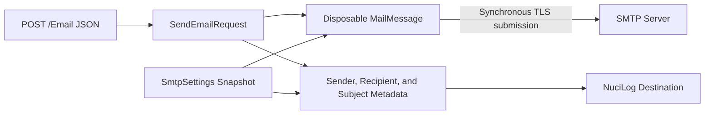
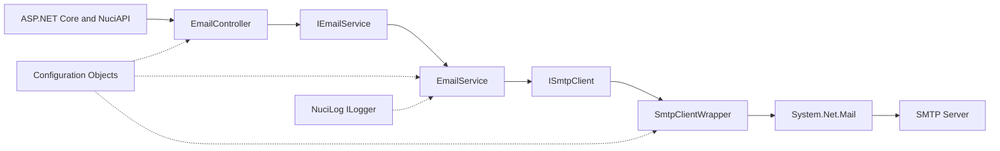

# NuciNotifications API Architecture

This document describes the verified current architecture of the NuciNotifications API. Its scope is the HTTP service, SMTP delivery path, operational configuration, and automated tests contained in this repository; it does not propose a target architecture or describe package internals that are not present here.

## 📑 Table of Contents

- [Table of Contents](#table-of-contents)
- [Purpose](#purpose)
- [System Context](#system-context)
- [Architectural Style](#architectural-style)
- [Runtime Flow](#runtime-flow)
- [Components](#components)
- [Data Architecture](#data-architecture)
- [Interfaces and Integrations](#interfaces-and-integrations)
- [Cross-Cutting Concerns](#cross-cutting-concerns)
- [Security and Privacy](#security-and-privacy)
- [Error Handling](#error-handling)
- [Observability](#observability)
- [Configuration](#configuration)
- [Concurrency and Resource Use](#concurrency-and-resource-use)
- [Dependency Direction and Rules](#dependency-direction-and-rules)
- [External Dependencies](#external-dependencies)
- [Deployment and Operations](#deployment-and-operations)
- [Compatibility Contracts](#compatibility-contracts)
- [Testing and Verification](#testing-and-verification)
- [Design Constraints](#design-constraints)
- [Extension Points](#extension-points)
- [SMTP Transport](#smtp-transport)
- [Source Map](#source-map)
- [Related Documentation](#related-documentation)

## 🎯 Purpose

NuciNotifications API is a compact notifications gateway that accepts an authorised HTTP request and submits one plain-text email through an operator-configured SMTP server. This document records the current process boundary, responsibility allocation, dependency direction, request and data flows, operational constraints, and compatibility-sensitive contracts for maintainers, integrators, reviewers, and operators.

## 🌐 System Context

The system boundary is one ASP.NET Core process. Calling applications initiate email delivery, configuration providers furnish settings and secrets, an external SMTP server accepts delivery submissions, and the configured logging destination receives operational records. The service has no database or durable delivery store.



The principal external boundaries are:
- **Calling applications:** Supply the API credentials and email fields, and consume the package-defined HTTP response.
- **Configuration and secret providers:** Supply the API key, SMTP credentials, delivery policy, and logger settings through the standard .NET host configuration pipeline; operators own secure injection and rotation.
- **Configured SMTP server:** Accepts synchronous, TLS-enabled SMTP submissions and owns subsequent relay and final delivery.
- **Configured log destination:** Receives request and delivery records through NuciLog; the repository configures a local file by default, while operators own file permissions and retention.

## 🏗️ Architectural Style

The repository implements a single-process, controller-service-adapter HTTP service. ASP.NET Core and package-provided middleware own transport concerns, `EmailController` owns the endpoint boundary, `EmailService` owns message construction and retry policy, and `SmtpClientWrapper` adapts the internal `ISmtpClient` port to `System.Net.Mail`. Dependency injection composes these collaborators in [ServiceCollectionExtensions.cs](NuciNotifications.API/ServiceCollectionExtensions.cs).



The principal architecture boundaries are:
- **Hosting and middleware boundary:** [Program.cs](NuciNotifications.API/Program.cs) and [Startup.cs](NuciNotifications.API/Startup.cs) construct the host, register dependencies, and define middleware order.
- **HTTP boundary:** [EmailController](NuciNotifications.API/Controllers/EmailsController.cs) delegates validation, API-key authorisation, and response processing to `NuciApiController.ProcessRequest` before invoking the application service.
- **Application boundary:** [EmailService](NuciNotifications.API/Service/EmailService.cs) constructs messages, selects the sender display name, emits delivery logs, and owns timeout retries.
- **Integration boundary:** [ISmtpClient](NuciNotifications.API/Service/ISmtpClient.cs) isolates application logic from the concrete SMTP client, while [SmtpClientWrapper](NuciNotifications.API/Service/SmtpClientWrapper.cs) owns SMTP configuration and synchronous network submission.

## 🔄 Runtime Flow



The principal runtime sequence is:
1. `Program.CreateHostBuilder` uses the default .NET host configuration and selects `Startup` as the composition root.
2. `Startup.ConfigureServices` registers controllers, binds `SecuritySettings` and `SmtpSettings`, adds NuciAPI scanner and replay protection, and registers the logger, email service, and SMTP adapter as singletons.
3. `Startup.Configure` orders exception handling, scanner protection, replay protection, request logging, the development exception page, HTTPS redirection, static-file support, routing, authorisation, and controller endpoints.
4. ASP.NET Core binds `POST /Email` JSON to `SendEmailRequest`; `[ApiController]` and data annotations govern request-model validation.
5. `EmailController` passes the request, delivery action, and API-key policy to the package-owned `ProcessRequest` method.
6. `EmailService` resolves the display name, logs non-body message metadata, constructs a disposable `MailMessage`, and invokes the SMTP adapter synchronously.
7. Success returns through `ProcessRequest`; recognised SMTP timeouts produce a warning and, while budget remains, a blocking delay followed by another attempt. Other exceptions are logged and rethrown to the exception middleware.

## 🧩 Components

| Component | Responsibility | Principal Dependencies | Lifetime or Ownership |
|-----------|----------------|------------------------|-----------------------|
| `Program` and `Startup` | Construct the web host, composition root, and ordered middleware pipeline | ASP.NET Core, NuciAPI middleware | One host process |
| NuciAPI middleware pipeline | Exception translation, scanner protection, replay protection, and request logging | Package-provided middleware, ASP.NET Core | Owned by the host pipeline; exact package internals are external to this repository |
| `EmailController` | Own `POST /Email`, create its API-key policy, and delegate request processing | `NuciApiController`, `IEmailService`, `SecuritySettings` | Activated by ASP.NET Core for an HTTP request |
| `SecuritySettings` and `SmtpSettings` | Retain the configuration snapshot consumed by runtime collaborators | .NET configuration binding | Singleton objects bound during service registration |
| `EmailService` | Construct email messages, select sender identity, log delivery state, and execute retry policy | `SmtpSettings`, `ISmtpClient`, `ILogger` | Singleton |
| `SmtpClientWrapper` | Configure and invoke one `System.Net.Mail.SmtpClient` with credentials, TLS, and a 200-second timeout | `SmtpSettings`, `System.Net.Mail`, SMTP server | Singleton wrapper retaining one client instance for the process lifetime |
| `NuciLogger` | Emit structured operation records | NuciLog configuration and destination | Singleton |

## 💾 Data Architecture

The service owns no domain database, queue, cache, or delivery-status record. Request data exists in memory, is transformed into `MailMessage`, and is transmitted to the SMTP server during the HTTP request. Configuration is bound once into singleton objects. Delivery metadata is emitted to NuciLog; the default configuration directs those records to a local file, whose retention and consistency are not defined by this repository.



| Data or Store | Owner | Representation and Storage | Lifecycle or Consistency |
|---------------|-------|----------------------------|--------------------------|
| `SendEmailRequest` | HTTP boundary | In-memory model containing optional `Sender` and required `Recipient`, `Subject`, and `Body` fields | Created by model binding for one request; not persisted by application code |
| `MailMessage` | `EmailService` | In-memory `System.Net.Mail.MailMessage` containing the configured sender address and request content | Constructed and disposed for each delivery attempt |
| Security and SMTP settings | Composition root | Plain .NET objects bound from host configuration | Singleton snapshot; runtime provider changes are not observed without process reconstruction |
| Delivery log records | `EmailService` and request-logging middleware | NuciLog operation records; `appsettings.json` selects `logfile.log` as the default file destination | Append and retention semantics belong to NuciLog and the operator; no rotation policy is present here |

## 🔌 Interfaces and Integrations

| Interface or Integration | Direction | Contract | Owner | Failure Semantics |
|--------------------------|-----------|----------|-------|-------------------|
| `POST /Email` | Inbound | HTTP JSON with optional `sender` and required `recipient`, `subject`, and `body`; API-key policy supplied to `ProcessRequest` | `EmailController` | `[ApiController]`, `ProcessRequest`, and exception middleware own rejection and HTTP translation; exact status mappings reside in external NuciAPI packages |
| SMTP submission | Outbound | Synchronous `System.Net.Mail` submission to configured host and port, authenticated by username and password, with TLS enabled and a 200-second client timeout | `SmtpClientWrapper` | Text-recognised timeout exceptions are retried by `EmailService`; other failures are logged and rethrown |
| NuciLog destination | Outbound | Structured request and `SendEmail` operation records; default destination is `logfile.log` | NuciAPI request logger and `EmailService` | Logger degradation or destination-failure semantics are package-owned and not defined in this repository |
| .NET host configuration | Inbound | Default host providers plus the copied `appsettings.json`; hierarchical environment variables can override values | `Program` and `ServiceCollectionExtensions` | Missing or malformed values are not validated explicitly during startup |

## 🧵 Cross-Cutting Concerns

### Security and Privacy

`EmailController` constructs an API-key authorisation policy from `SecuritySettings.ApiKey` and delegates enforcement to `NuciApiController.ProcessRequest`. The request type inherits `NuciApiRequest` and declares `[HmacOrder]` metadata, while scanner and replay-protection middleware are placed before routing. The precise HMAC headers, optional-signing activation, replay policy, and HTTP rejection shapes belong to external NuciAPI and NuciSecurity packages and are not defined in repository source.

HTTPS redirection is configured for inbound traffic, and the SMTP adapter enables TLS with credential-based authentication. Deployment remains responsible for valid certificates, forwarding configuration, and secure secret injection. The tracked configuration contains substitution tokens rather than live credentials; production API keys and SMTP passwords must originate from an appropriate secret provider rather than source control.

Delivery logs contain the configured sender address, display name, recipient address, and subject. `EmailService` does not add the message body or credentials to its operation metadata, but request-logging redaction and file-retention policies are package or operator responsibilities. Recipient addresses and subjects must therefore be treated as potentially sensitive data.

### Error Handling

The first configured middleware is NuciAPI exception handling, which surrounds subsequent middleware and endpoints. In development, the ASP.NET Core developer exception page is also inserted downstream. Exact exception-to-HTTP mappings are package-defined.

`EmailService` distinguishes timeout failures by searching `SmtpException.Message` for `timed out`, `timeout`, or `Timeout`. A recognised timeout emits a warning, then either retries after the configured delay or throws `TimeoutException` when the retry budget is exhausted. Every other exception emits an error record and is rethrown unchanged. There is no fallback transport, dead-letter store, or partial-success representation.

### Observability

NuciAPI request logging records HTTP activity, while `EmailService` emits `SendEmail` operation states through NuciLog. Each attempt emits `Started`; successful submission emits `Success`; recognised timeouts emit warnings with an attempt number; other failures include the exception in an error record. The configured log metadata includes sender address, sender display name, recipient, and subject.

The default logger configuration enables file output to `logfile.log`. The repository defines no health endpoint, metrics, distributed traces, audit store, correlation contract, log rotation, or delivery-status query.

### Configuration

| Configuration Area | Source | Responsibility | Override or Secret Policy |
|--------------------|--------|----------------|---------------------------|
| `SecuritySettings` | `appsettings.json` and default .NET host providers | Supplies the API key used by the controller policy | Environment variables or another standard provider must inject production secrets; values are bound once as a singleton |
| `SmtpSettings` | `appsettings.json` and default .NET host providers | Supplies host, port, credentials, sender name, retry budget, and retry delay | Environment variables or mounted secret providers can override file values; credentials must not be committed |
| `NuciLoggerSettings` | `appsettings.json` through `AddNuciLoggerSettings` | Selects logger destinations and the file path | Package-defined binding applies; the operator owns destination permissions and retention |

`Host.CreateDefaultBuilder` determines provider precedence. [appsettings.json](NuciNotifications.API/appsettings.json) is copied to the output directory, and [ServiceCollectionExtensions.cs](NuciNotifications.API/ServiceCollectionExtensions.cs) binds settings directly rather than using monitored options. The application contains no explicit startup validation for required settings, numeric ranges, or unresolved substitution tokens.

### Concurrency and Resource Use

The endpoint remains occupied until SMTP submission, retry completion, or failure. Both `SmtpClient.Send` and retry delays are synchronous; `Thread.Sleep` retains a request-processing thread during every delay. There is no queue, cancellation token, timeout budget spanning all attempts, concurrency limit, or backpressure mechanism.

All custom services are singletons. Consequently, concurrent requests invoke the same `SmtpClientWrapper` and its retained `SmtpClient` instance without repository-defined synchronisation. Each `MailMessage` is disposed by `EmailService`, but the wrapper does not implement explicit disposal for its retained SMTP client. These lifetime choices constrain concurrency and deterministic resource release.

## 🧭 Dependency Direction and Rules

Production dependencies proceed from the host and HTTP boundary toward application orchestration, then through the SMTP port to the concrete integration adapter. Configuration and logging are injected cross-cutting dependencies. The unit-test project depends upon the API project, while production code has no dependency upon tests.



The principal dependency rules are:
- Controllers may depend upon application contracts and bound settings, but SMTP construction and retry policy remain outside the transport boundary.
- `EmailService` depends upon `ISmtpClient`, not directly upon `System.Net.Mail.SmtpClient`, so service tests can substitute the integration boundary.
- `SmtpClientWrapper` owns concrete SMTP configuration and must not depend upon controllers or request-processing packages.
- Package-provided middleware and controller helpers own HTTP security and response translation; application services propagate failures without constructing HTTP responses.
- The API project must remain independent of `NuciNotifications.API.UnitTests`; tests may reference and instantiate API components.

## 📦 External Dependencies

| Dependency | Responsibility | Integration Boundary | Architectural Consequence |
|------------|----------------|----------------------|---------------------------|
| ASP.NET Core on .NET 10 | Web hosting, configuration, dependency injection, model binding, routing, and middleware | `Program`, `Startup`, and `EmailController` | The service is deployed as a .NET 10 web process and follows ASP.NET Core lifecycle and hosting conventions |
| `NuciAPI` and `NuciAPI.Controllers` | Request base types, controller request processing, and API-key policy integration | `SendEmailRequest` and `EmailController` | HTTP authorisation and response semantics are coupled to package contracts and versions |
| NuciAPI middleware packages | Exception handling, request logging, scanner protection, and replay protection | `Startup` middleware composition | Security and error semantics partly reside beyond repository source; middleware order is consequential |
| `NuciLog` and `NuciLog.Core` | Structured operation logging and configured destinations | `ServiceCollectionExtensions`, `EmailService`, and logging identifiers | Operational records and destination conduct depend upon package contracts |
| `NuciSecurity.HMAC` | HMAC ordering metadata for request fields | `SendEmailRequest` | Field order is compatibility-sensitive for clients that sign requests |
| `System.Net.Mail` | Message representation and synchronous SMTP client | `EmailService` and `SmtpClientWrapper` | Delivery is synchronous and inherits `SmtpClient` timeout and concurrency characteristics |
| Configured SMTP service | Message relay beyond the application boundary | `SmtpClientWrapper` | Availability, authentication, relay policy, and final delivery remain external dependencies |

## 🚀 Deployment and Operations

The deployment unit is the output of [NuciNotifications.API.csproj](NuciNotifications.API/NuciNotifications.API.csproj), executed as one ASP.NET Core process. Kestrel addresses, environment selection, and shutdown signals follow standard host configuration. The service requires inbound HTTP connectivity, outbound connectivity to the configured SMTP host and port, access to injected secrets, and write access when file logging is enabled.

There is no database, queue, container manifest, service manifest, or repository-defined orchestration. The process retains configuration, logger, email service, and SMTP client instances in memory. Functional email state is not persisted, although local log files create per-instance operational state. Multiple replicas would submit and log independently, with no shared delivery ledger or coordination.

[dotnet.yml](.github/workflows/dotnet.yml) restores, compiles, and tests the solution on Ubuntu for pushes and pull requests to `master`. [release.sh](release.sh) downloads and executes a remote .NET 10 release script at invocation time; its packaging destination and deployment topology are not defined in this repository, and its unpinned remote content can vary independently.

| Concern | Current Design | Architectural Consequence |
|---------|----------------|---------------------------|
| Process topology | One ASP.NET Core web process containing all runtime components | A process failure interrupts both HTTP acceptance and in-progress SMTP submission |
| Persistent state | No delivery store; optional local NuciLog file output | Delivery history cannot be queried or recovered from application state; logs are replica-local unless externalised |
| Network | Inbound HTTP with HTTPS redirection and outbound TLS-enabled SMTP | Operators must configure certificates, proxy forwarding, DNS, firewall access, SMTP credentials, and relay permissions |
| Scaling | No repository-defined coordination, queue, or shared mutable domain state | Replicas can receive requests independently, but each retains its own SMTP client and log destination |
| Availability and recovery | The HTTP request waits for SMTP completion and retries | SMTP latency and outages directly consume request capacity; process termination loses in-progress operations |
| Release automation | Local script delegates to a remotely hosted script | Reproducibility and deployment behaviour depend upon external script availability and content |

## 🛡️ Compatibility Contracts

| Contract | Owner | Invariant | Verification | Change Policy |
|----------|-------|-----------|--------------|---------------|
| `POST /Email` | `EmailController` | HTTP POST route remains `/Email` and invokes one email-delivery operation | No controller integration test currently verifies the route or response | Route or method changes require coordinated client migration and new integration coverage |
| `SendEmailRequest` | HTTP boundary | `sender` is optional; `recipient`, `subject`, and `body` are required | Data annotations are present; service tests verify value transfer but not model binding | Field removal, renaming, or requirement changes require an explicit API compatibility decision |
| HMAC field ordering | `SendEmailRequest` | `Sender`, `Recipient`, `Subject`, and `Body` retain order values 1, 2, 5, and 6 respectively | No automated signing-contract test is present | Order changes require coordinated signed-client migration and package-level verification |
| Configuration sections | Composition root | `SecuritySettings`, `SmtpSettings`, and `NuciLoggerSettings` names and property shapes remain bindable by standard providers | Exercised indirectly at runtime; no configuration-binding test is present | Renames require compatible aliases or coordinated deployment configuration changes |
| Sender identity | `EmailService` | Configured SMTP username is the sender address; non-empty request sender overrides only the display name, otherwise configured `SenderName` applies | Covered by `EmailServiceTests` | Changes can alter relay acceptance and visible sender identity and therefore require behavioural tests |

## ✅ Testing and Verification

[NuciNotifications.API.UnitTests](NuciNotifications.API.UnitTests/NuciNotifications.API.UnitTests.csproj) uses NUnit and Moq and references the API project directly. [EmailServiceTests.cs](NuciNotifications.API.UnitTests/Service/EmailServiceTests.cs) verifies SMTP invocation, sender and message mapping, default display-name selection, operation logging, recognised timeout retries, terminal timeout translation, and propagation of non-timeout failures. The test substitutes both `ISmtpClient` and `ILogger`, so it verifies application orchestration without network or filesystem effects.

There is no automated controller, model-binding, middleware-order, API-key, HMAC, configuration-binding, logger-destination, live SMTP, concurrency, deployment, or end-to-end test. CI performs restore, compilation, and the available unit tests but does not verify delivery through a real SMTP provider.

Execute the principal automated verification with:

```bash
dotnet restore
dotnet build --no-restore
dotnet test --no-build --verbosity normal
```

## ⚠️ Design Constraints

- **Synchronous Delivery:** SMTP submission and retry delays execute within the HTTP request, so provider latency and outage duration directly consume request threads and client response time.
- **Retry Semantics:** `MaximumAttempts` currently acts as the number of retries after the initial attempt; a value of 1 permits two SMTP sends. Timeout classification depends upon three case-sensitive message fragments rather than an SMTP status or exception property.
- **Duplicate Delivery Risk:** A timeout does not establish whether the SMTP provider accepted the preceding submission, and there is no idempotency or delivery ledger; a retry can therefore submit the same message more than once.
- **Shared SMTP Client:** Every request reaches one singleton `SmtpClient` without repository-defined serialisation, pooling, or concurrency protection.
- **Configuration Snapshot:** Settings are bound once and are not explicitly validated, so invalid numbers, absent secrets, or unresolved tokens can survive startup and fail during request processing.
- **Package-Owned HTTP Semantics:** Authorisation, replay protection, request logging, and exception-to-response details reside in external packages, limiting repository-local verification and requiring care during package upgrades.
- **Local Operational State:** Default file logging creates privacy, retention, disk-capacity, and multi-replica aggregation responsibilities that the service does not manage.
- **No Durable Workflow:** The service contains no queue, persistence, delivery receipt, status endpoint, or reconciliation process; successful return means SMTP submission completed without an exception, not that the recipient received the message.

## 🔧 Extension Points

### SMTP Transport

1. Implement [ISmtpClient](NuciNotifications.API/Service/ISmtpClient.cs) with the required transport or test substitute.
2. Register the implementation at `AddCustomServices` in [ServiceCollectionExtensions.cs](NuciNotifications.API/ServiceCollectionExtensions.cs), selecting a lifetime compatible with its concurrency and disposal requirements.
3. Add focused `EmailService` tests and integration coverage for transport-specific success, timeout, and failure semantics.

The contract is synchronous `Send(MailMessage)`. Implementations must return only after submission completes or throw an exception that `EmailService` can classify; `EmailService` retains ownership of disposing the supplied message. A transport that requires asynchronous execution, cancellation, durable queuing, or a different failure taxonomy requires a deliberate contract revision rather than an adapter-only substitution.

## 🗺️ Source Map

| Area | Path |
|------|------|
| Solution inventory | [NuciNotifications.slnx](NuciNotifications.slnx) |
| Runtime entry point | [NuciNotifications.API/Program.cs](NuciNotifications.API/Program.cs) |
| Composition and middleware | [NuciNotifications.API/Startup.cs](NuciNotifications.API/Startup.cs), [NuciNotifications.API/ServiceCollectionExtensions.cs](NuciNotifications.API/ServiceCollectionExtensions.cs) |
| HTTP endpoint and request contract | [NuciNotifications.API/Controllers/EmailsController.cs](NuciNotifications.API/Controllers/EmailsController.cs), [NuciNotifications.API/Requests/SendEmailRequest.cs](NuciNotifications.API/Requests/SendEmailRequest.cs) |
| Delivery orchestration and SMTP adapter | [NuciNotifications.API/Service](NuciNotifications.API/Service) |
| Configuration contracts | [NuciNotifications.API/Configuration](NuciNotifications.API/Configuration), [NuciNotifications.API/appsettings.json](NuciNotifications.API/appsettings.json) |
| Logging vocabulary | [NuciNotifications.API/Logging](NuciNotifications.API/Logging) |
| Unit tests | [NuciNotifications.API.UnitTests/Service/EmailServiceTests.cs](NuciNotifications.API.UnitTests/Service/EmailServiceTests.cs) |
| Continuous integration | [.github/workflows/dotnet.yml](.github/workflows/dotnet.yml) |
| Release delegation | [release.sh](release.sh) |

The root [Program.cs](Program.cs) is outside the API project directory and is not included by the project manifest or solution as a separate project. The runtime entry point is the file beneath `NuciNotifications.API`.

## 📚 Related Documentation

- [README.md](README.md) defines installation requirements, configuration keys, local execution, and the consumer-facing request example. This architecture document concentrates upon boundaries, ownership, runtime interaction, and change-sensitive constraints.