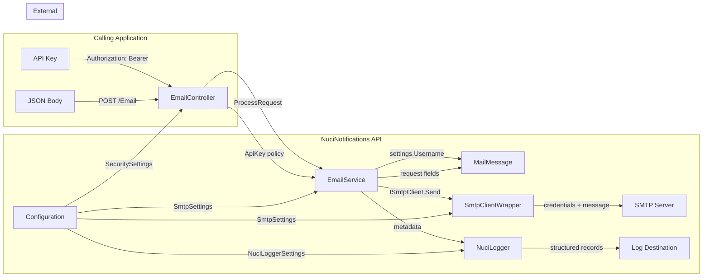

# Data Flow and Data Architecture

This document traces all data flows through the NuciNotifications API, from ingress to egress, including data transformations, storage, and lifecycle.

---

## Data Flow Overview

```
┌─────────────────┐     ┌──────────────────┐     ┌──────────────────┐     ┌─────────────────┐
│  Calling App    │     │  NuciNotifications │     │  SMTP Server     │     │  Log Destination │
│                 │     │  API               │     │                   │     │                   │
│  POST /Email    │────►│  EmailController   │────►│  SmtpClientWrapper│────►│  NuciLogger       │
│  (JSON body)    │     │  EmailService      │     │  System.Net.Mail  │     │  (logfile.log)    │
│  API key header │     │  (retry logic)     │     │  (TLS, auth)      │     │  (structured)     │
└─────────────────┘     └──────────────────┘     └──────────────────┘     └─────────────────┘
                              │
                              ▼
                        Configuration
                        (SecuritySettings,
                         SmtpSettings)
```

---

## 1. Inbound Data Flow: HTTP Request

### 1.1 Request Ingress

**Source:** Calling application
**Protocol:** HTTPS POST
**Endpoint:** `/Email`
**Headers:**
- `Authorization: Bearer <api-key>` (required)
- `X-HMAC: <url-encoded-token>` (optional, for signed requests)
- `Content-Type: application/json` (required)

**Request Body (JSON):**
```json
{
  "sender": "Display Name",       // optional, string
  "recipient": "user@example.com", // required, string
  "subject": "Subject line",       // required, string
  "body": "Plain text body"        // required, string
}
```

### 1.2 Middleware Processing

| Middleware | Data Accessed | Data Modified | Data Emitted |
|------------|---------------|---------------|--------------|
| ExceptionHandling | — | Wraps pipeline in try/catch | HTTP error responses on exceptions |
| ScannerProtection | Request headers, path | — | Blocks scanner patterns |
| ReplayProtection | Request headers, body hash | — | Blocks replayed requests |
| RequestLogging | Request method, path, headers, status | — | Structured HTTP log records |

### 1.3 Model Binding

**Input:** Raw JSON body
**Output:** `SendEmailRequest` object

```csharp
public sealed class SendEmailRequest : NuciApiRequest
{
    [HmacOrder(1)]
    public string Sender { get; set; }        // optional

    [Required]
    [HmacOrder(2)]
    public string Recipient { get; set; }     // required

    [Required]
    [HmacOrder(5)]
    public string Subject { get; set; }       // required

    [Required]
    [HmacOrder(6)]
    public string Body { get; set; }          // required
}
```

**Validation:** `[ApiController]` enforces `[Required]` attributes → 400 on missing fields

**HMAC Ordering:** Fields ordered by `[HmacOrder]` attribute for signature computation:
- Sender: 1
- Recipient: 2
- Subject: 5
- Body: 6

### 1.4 Authorisation

**Input:** `Authorization` header value
**Comparison:** `NuciApiAuthorisation.ApiKey(securitySettings.ApiKey)`
**Mechanism:** `NuciApiController.ProcessRequest` extracts Bearer token, compares with configured API key

**Data Flow:**
```
Authorization header → Bearer prefix stripped → API key extracted → Compared with SecuritySettings.ApiKey
```

---

## 2. Internal Data Flow: EmailService

### 2.1 Sender Display Name Resolution

```
Input: request.Sender (string, optional)
       settings.SenderName (string, default "Notifier")

Logic:
    senderName = settings.SenderName
    if (!string.IsNullOrWhiteSpace(request.Sender))
        senderName = request.Sender

Output: senderName (string)
```

**Decision Table:**

| request.Sender | settings.SenderName | Result |
|----------------|---------------------|--------|
| "Solaire of Astora" | "Notifier" | "Solaire of Astora" |
| null | "Notifier" | "Notifier" |
| "" | "Notifier" | "Notifier" |
| "   " | "Notifier" | "Notifier" |
| "Solaire of Astora" | "Custom Name" | "Solaire of Astora" |

### 2.2 Log Metadata Construction

```
Input: settings.Username, senderName, request.Recipient, request.Subject

Output: IEnumerable<LogInfo>
    [
        LogInfo(SenderAddress, settings.Username),
        LogInfo(SenderName, senderName),
        LogInfo(Recipient, request.Recipient),
        LogInfo(Subject, request.Subject)
    ]
```

**Excluded from logs:** `request.Body`, `settings.Password`, `settings.ApiKey`

### 2.3 MailMessage Construction

```
Input: settings.Username, request.Recipient, request.Subject, request.Body, senderName

Output: MailMessage
    From: new MailAddress(settings.Username, senderName)
    To: [request.Recipient]
    Subject: request.Subject
    Body: request.Body
```

**Data Transformation:**
- `settings.Username` → `MailAddress.Address` (email address)
- `senderName` → `MailAddress.DisplayName` (display name)
- `request.Recipient` → `MailMessage.To[0].Address`
- `request.Subject` → `MailMessage.Subject`
- `request.Body` → `MailMessage.Body`

### 2.4 SMTP Submission

```
Input: MailMessage

Flow:
    SmtpClientWrapper.Send(message)
        └── SmtpClient.Send(message)
                ├── Connect to settings.Host:settings.Port
                ├── STARTTLS negotiation (EnableSsl=true)
                ├── Authenticate: NetworkCredential(settings.Username, settings.Password)
                ├── Send: MAIL FROM, RCPT TO, DATA
                └── Wait for response (Timeout = 200,000ms)

Output: void (success) or SmtpException (failure)
```

**Data Sent to SMTP Server:**
- Sender address: `settings.Username`
- Recipient address: `request.Recipient`
- Subject: `request.Subject`
- Body: `request.Body`
- Credentials: `settings.Username`, `settings.Password`

---

## 3. Retry Logic Data Flow

### 3.1 Timeout Detection

```
Input: Exception from SmtpClient.Send()

Logic:
    if (exception is SmtpException)
        if (exception.Message.Contains("timed out") ||
            exception.Message.Contains("timeout") ||
            exception.Message.Contains("Timeout"))
            → Recognised as timeout
        else
            → Non-timeout SmtpException
    else
        → Non-SmtpException (general failure)

Output: Classification (timeout | non-timeout | other)
```

**Case Sensitivity:** Substring matching is case-sensitive.
- "timed out" ✅ recognised
- "timeout" ✅ recognised
- "Timeout" ✅ recognised
- "TIMEOUT" ❌ NOT recognised
- "Timed Out" ❌ NOT recognised

### 3.2 Retry Decision

```
Input: attemptsLeft (int, starts at settings.MaximumAttempts)

Logic:
    if (attemptsLeft <= 0)
        → Throw TimeoutException
    else
        → Thread.Sleep(settings.DelayBetweenAttemptsInSeconds * 1000)
        → Recursive Send(request, attemptsLeft - 1)

Output: Retry or TimeoutException
```

### 3.3 Attempt Number Calculation

```
Input: settings.MaximumAttempts, attemptsLeft

Formula: attemptNumber = settings.MaximumAttempts - attemptsLeft + 1

Example (MaximumAttempts = 3):
    Attempt 1: attemptsLeft=3 → 3-3+1 = 1
    Attempt 2: attemptsLeft=2 → 3-2+1 = 2
    Attempt 3: attemptsLeft=1 → 3-1+1 = 3
    Attempt 4: attemptsLeft=0 → 3-0+1 = 4 (then throws TimeoutException)
```

---

## 4. Outbound Data Flow: Logging

### 4.1 Log Record Structure

**NuciLog Record Fields:**
```
Operation: "SendEmail"
Status: Started | Success | Failure
Timestamp: (added by NuciLog)
Metadata:
    SenderAddress: settings.Username
    SenderName: resolved senderName
    Recipient: request.Recipient
    Subject: request.Subject
    Attempt: attemptNumber (only on timeout warnings)
Exception: exception details (only on error logs)
```

### 4.2 Log Emission Points

| Event | Log Level | Operation | Status | Additional Metadata |
|-------|-----------|-----------|--------|-------------------|
| Delivery starts | Info | SendEmail | Started | SenderAddress, SenderName, Recipient, Subject |
| Delivery succeeds | Info | SendEmail | Success | SenderAddress, SenderName, Recipient, Subject |
| Timeout (retry) | Warn | SendEmail | Failure | + Attempt number |
| Timeout (exhausted) | Warn | SendEmail | Failure | + Attempt number |
| Non-timeout error | Error | SendEmail | Failure | + Exception |

### 4.3 Log Destination

**Default:** `logfile.log` in process working directory
**Format:** NuciLog structured format (package-defined)
**Retention:** Operator-defined (no built-in rotation)
**Permissions:** Operator must secure file access

---

## 5. Configuration Data Flow

### 5.1 Configuration Sources (in precedence order)

```
1. appsettings.json (base)
2. appsettings.{Environment}.json (override)
3. Environment variables (override)
4. Command-line arguments (override)
5. User secrets (Development only)
6. External providers (Key Vault, etc.)
```

### 5.2 Binding Process

```
Host.CreateDefaultBuilder()
    └── IConfiguration built from all sources

Startup.ConfigureServices()
    └── AddConfigurations(configuration)
            ├── new SecuritySettings()
            │       └── configuration.Bind("SecuritySettings", securitySettings)
            │       └── services.AddSingleton(securitySettings)
            │
            ├── new SmtpSettings()
            │       └── configuration.Bind("SmtpSettings", smtpSettings)
            │       └── services.AddSingleton(smtpSettings)
            │
            └── AddNuciLoggerSettings(configuration)
                    └── Binds NuciLoggerSettings (package-defined)
```

### 5.3 Configuration Data Lifecycle

| Data | Source | Bound At | Lifetime | Mutability |
|------|--------|----------|----------|------------|
| SecuritySettings.ApiKey | appsettings.json / env var | Startup | Singleton | Immutable after startup |
| SmtpSettings.* | appsettings.json / env var | Startup | Singleton | Immutable after startup |
| NuciLoggerSettings.* | appsettings.json / env var | Startup | Singleton | Immutable after startup |

---

## 6. Data Lifecycle Summary

### 6.1 Data Categories

| Category | Source | Processed By | Stored By | Transmitted To | Deleted By |
|----------|--------|--------------|-----------|----------------|------------|
| API key | Operator config | EmailController (auth) | Process memory (singleton) | None | Process exit |
| SMTP credentials | Operator config | SmtpClientWrapper | Process memory (singleton) | SMTP server | Process exit |
| Email request fields | Calling app | EmailService | Request memory | SMTP server | Request end |
| Delivery metadata | EmailService | EmailService | Log destination | None | Operator-defined |
| HTTP request logs | Middleware | NuciAPI middleware | Log destination | None | Operator-defined |

### 6.2 Data Flow Diagram



### 6.3 Data Retention

| Data | Retention Period | Deletion Mechanism |
|------|------------------|-------------------|
| API key (memory) | Process lifetime | Process exit |
| SMTP credentials (memory) | Process lifetime | Process exit |
| Email request fields | Request lifetime | GC after request |
| MailMessage | Per delivery attempt | `using` disposal |
| Delivery metadata (logs) | Operator-defined | Log rotation (external) |
| HTTP request logs | Operator-defined | Log rotation (external) |

---

## 7. Data Security Boundaries

### 7.1 What the Application Does NOT Do

- Does not persist email content to disk (beyond SMTP server)
- Does not store delivery status or receipts
- Does not send data to project maintainers
- Does not perform analytics or telemetry
- Does not encrypt data at rest (no persistent data)
- Does not implement data subject request endpoints

### 7.2 What the Application DOES Do

- Reads API key and SMTP credentials into process memory
- Logs sender address, display name, recipient, subject (NOT body, NOT credentials)
- Transmits email content to operator-configured SMTP server
- Writes structured logs to operator-configured destination

### 7.3 Operator Responsibilities

| Responsibility | Application Control | Operator Control |
|----------------|---------------------|------------------|
| Secret injection | Reads from config providers | Must use secure providers |
| Secret rotation | Requires restart | Must orchestrate rotation |
| Log retention | Writes to configured destination | Must configure rotation |
| Log access control | None | Must secure log files |
| Network security | TLS for SMTP | Must configure firewalls, proxies |
| Certificate management | Validates SMTP cert | Must provide valid certs |
| Data subject requests | No endpoint | Must handle externally |

---

## 8. Data Transformation Summary

### 8.1 Request → MailMessage

| Request Field | MailMessage Property | Transformation |
|---------------|---------------------|----------------|
| `request.Sender` | `MailMessage.From.DisplayName` | Used if non-empty; else `settings.SenderName` |
| `settings.Username` | `MailMessage.From.Address` | Direct assignment |
| `request.Recipient` | `MailMessage.To[0].Address` | Direct assignment |
| `request.Subject` | `MailMessage.Subject` | Direct assignment |
| `request.Body` | `MailMessage.Body` | Direct assignment |

### 8.2 Request → Log Metadata

| Request Field | LogInfoKey | Included? |
|---------------|------------|-----------|
| `settings.Username` | SenderAddress | ✅ Yes |
| `request.Sender` / `settings.SenderName` | SenderName | ✅ Yes |
| `request.Recipient` | Recipient | ✅ Yes |
| `request.Subject` | Subject | ✅ Yes |
| `request.Body` | — | ❌ No |
| `settings.Password` | — | ❌ No |
| `settings.ApiKey` | — | ❌ No |

### 8.3 Exception → Log/Error

| Exception Type | Log Level | Status | Additional Info |
|----------------|-----------|--------|-----------------|
| SmtpException (timeout) | Warn | Failure | Attempt number |
| SmtpException (timeout, exhausted) | Warn | Failure | Attempt number |
| SmtpException (non-timeout) | Error | Failure | Exception |
| Other Exception | Error | Failure | Exception |
| TimeoutException (thrown) | — | — | Propagated to middleware |

---

## 9. Data Integrity Guarantees

### 9.1 What IS Guaranteed

- Email fields are passed through verbatim (no modification)
- Sender display name resolution is deterministic (non-empty wins)
- Log metadata excludes body and credentials
- `MailMessage` is disposed after each attempt (`using` statement)
- Non-timeout exceptions are rethrown with original identity (`throw;`)

### 9.2 What is NOT Guaranteed

- **Delivery guarantee** — SMTP submission success ≠ recipient delivery
- **No duplicates** — Timeout retries may cause duplicate emails
- **No ordering** — Concurrent requests may interleave
- **No persistence** — No delivery ledger or status tracking
- **No validation** — Configuration values not validated at startup
- **No encryption** — No data-at-rest encryption (no persistent data)
- **No audit trail** — No tamper-proof logging

---

## 10. Cross-Cutting Data Concerns

### 10.1 Privacy

**Personal data handled:**
- Recipient email addresses
- Sender email addresses (SMTP username)
- Sender display names
- Email subjects

**Personal data NOT handled:**
- Message bodies (logged) — ✅ Not logged
- SMTP passwords — ✅ Not logged
- API keys — ✅ Not logged

**Data minimization:** Only sender, recipient, subject logged. Body and credentials excluded.

### 10.2 Compliance Notes

- **GDPR:** Operator is data controller for email content; application is data processor for delivery
- **CCPA:** No sale of personal data; no built-in consumer data portal
- **HIPAA:** Not configured for healthcare; operator must assess
- **PCI DSS:** No cardholder data handled

### 10.3 Data Breach Considerations

- **Log files** contain recipient addresses and subjects — treat as sensitive
- **Process memory** contains credentials — protect via process isolation
- **SMTP server** receives full email content — operator must trust SMTP provider
- **No encryption at rest** — no persistent data to encrypt